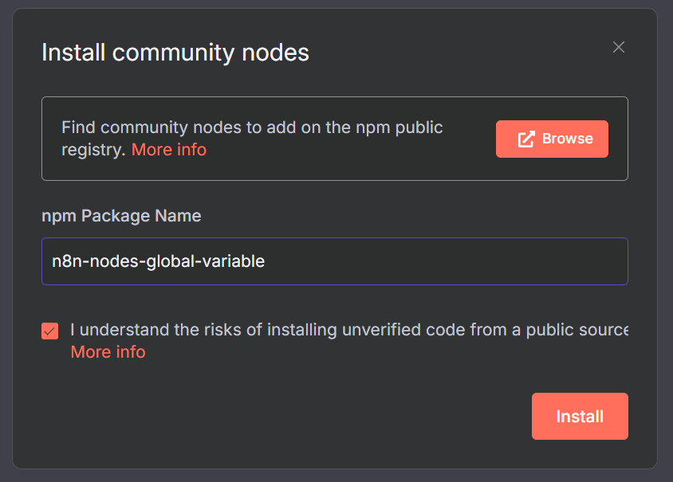
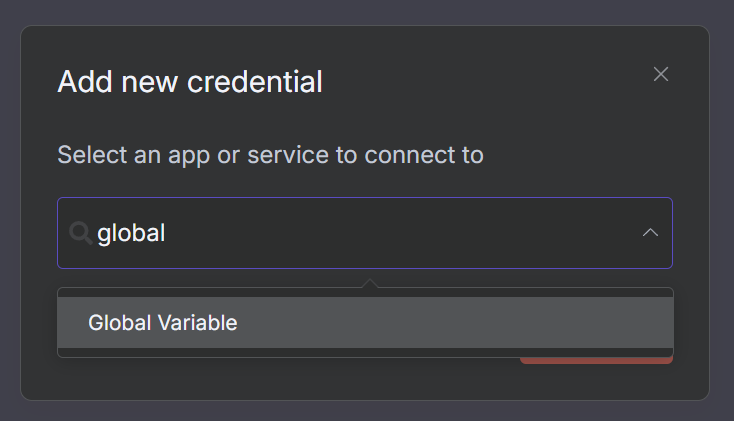
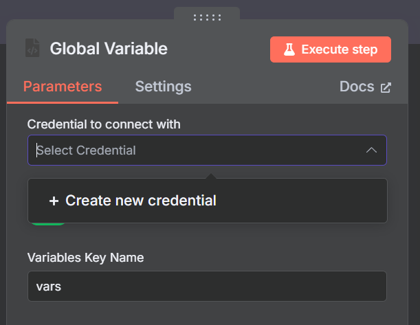
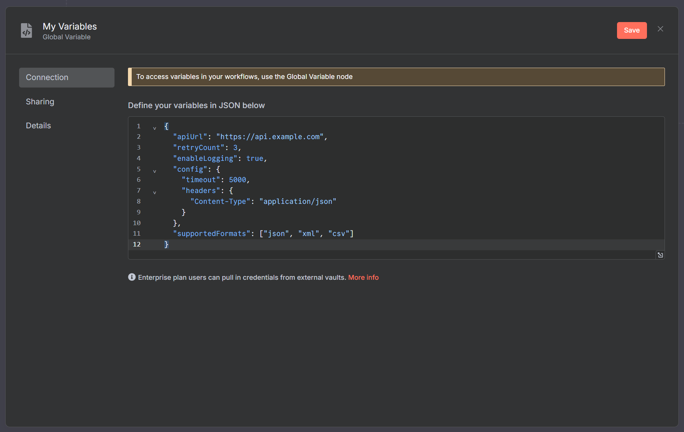
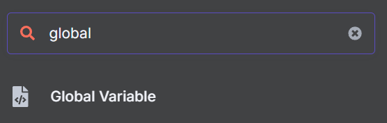
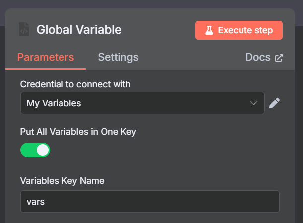
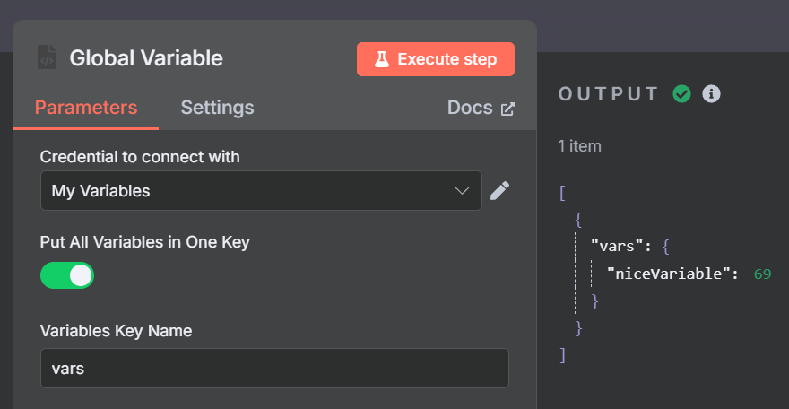

# Global Variable n8n Node

### Install `n8n-nodes-global-variable`

> Requires self-hosted n8n



# How it works

## 1. Create a `Global Variable` credential

> Note: you can have as many of these as you want to organize your variables.



> If you add a `Global Variable` node to your workflow first, you'll get an opportunity to easily create a credential:
>
> 

## 2. Define your variables as JSON

Simply define all your variables in a single JSON field. You can include any type of data - strings, numbers, booleans, objects, arrays, etc.

### Example variables JSON:

```json
{
  "apiUrl": "https://api.example.com",
  "retryCount": 3,
  "enableLogging": true,
  "config": {
    "timeout": 5000,
    "headers": {
      "Content-Type": "application/json"
    }
  },
  "supportedFormats": ["json", "xml", "csv"]
}
```



## 3. Add a `Global Variable` node in your workflow

> Choose the credential you created in step 1.





## That's it!

Wherever the node is used, your variables will be available in the workflow after the node is executed in `$json`.



### `$json.vars.X`

If you choose `Put All Variables in One Key` in the node options, all variables will be available under the `$json.<the name you chose>` key.

### `$json.X`

If you disable `Put All Variables in One Key` in the node options, each variable will be available under its own key in `$json`.

## Does not overwrite existing variables

If you have existing variables in your workflow, the `Global Variable` node will not overwrite them.

It will only add the variables that are defined in the credential.

# Attribution

> Inspired by `n8n-nodes-globals` and `n8n-nodes-global-variables`
>
> https://github.com/umanamente/n8n-nodes-globals (MIT)  
> https://github.com/mrowrpurr/n8n-nodes-global-variables (MIT)